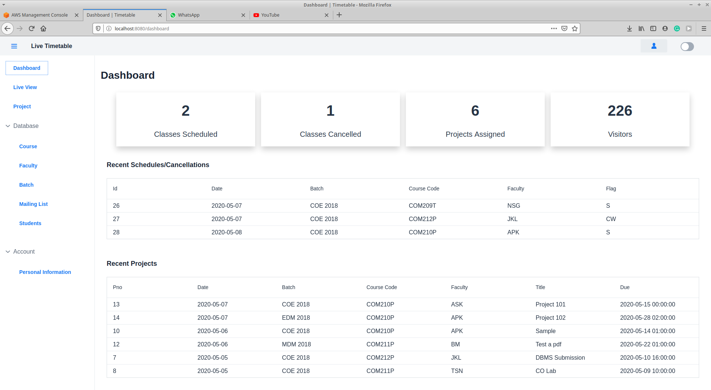
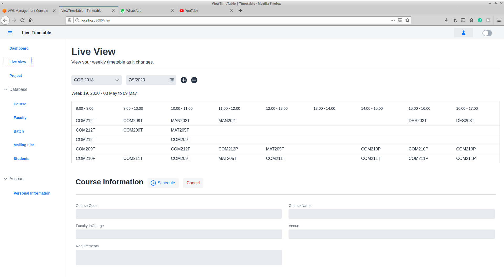
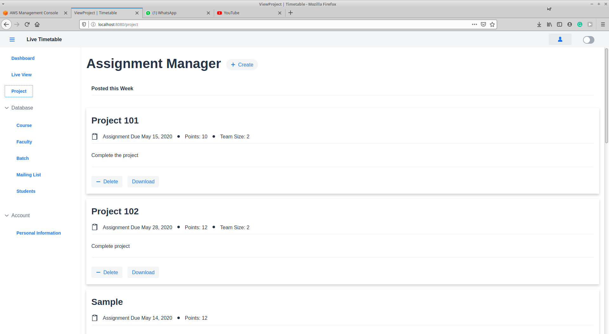
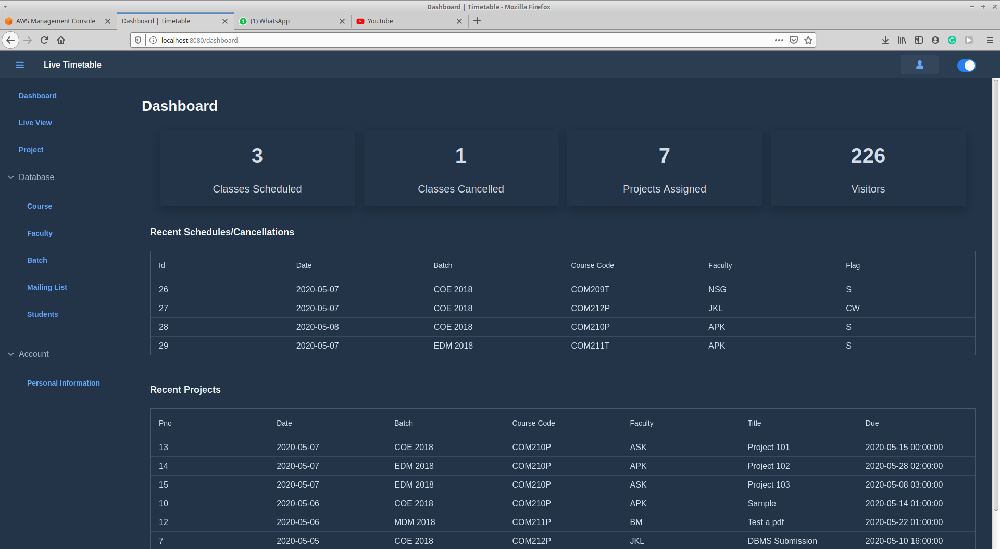

# Live Time

This is a web application build on a Spring boot starter with Vaadin framework with MySQL backend. 

## About
Live Time table is a simple, easy to use web application that helps users view their timetable on the fly. 
Instead of continuous back and forth communication between you, the TA, and the faculty, with scope for  miscommunications, we eliminate the middleman! Direct communication between the faculty and you and it’s instant!

## Project Structure

*   [resources](https://github.com/Adhesh148/Live-Time/tree/master/resources)
> Contains resources gathered during development including timetable of my college and other related information.

*   [sql](https://github.com/Adhesh148/Live-Time/tree/master/sql)
> Contains sql dump for the tables used in the application

*   [backend_entries](https://github.com/Adhesh148/Live-Time/tree/master/backend_entries)
> Contains csv files of the entries gathered for the backend tables.

*   [timetable](https://github.com/Adhesh148/Live-Time/tree/master/timetable)
> Contains the java Spring-boot project, a.k.a, the front-end of the application. Instruction to run the project is included as well.

## Documentation
A link to the detailed documentation of the project is provided here:  
https://docs.google.com/document/d/1y5_eQn6QWDBolpD0KiZO-KcqQ5wLPsUQDuTQD_O76I4/edit?usp=sharing  
A demo of certain features  
https://www.youtube.com/watch?v=wYbrWZcp4Cc&feature=youtu.be

## Deployment (Not applicable now)
The database (MySQL) has been deployed on the Amazon RDS and the web app has been deployed using the AWS Elastic Beanstalk Web service. Here is the link to the hosted version.
http://livetimetable-env.eba-gmnhuzkq.ap-south-1.elasticbeanstalk.com/login

Credentials:
* User Login:
    * Username : guest_user
    * Password : 123
* Admin Login:
    * Username : guest_admin
    * Password : 123

Two of the features do not seem to be working on the hosted version due to certain technical difficulties. A video demo of those features are provided here.
https://www.youtube.com/watch?v=wYbrWZcp4Cc&feature=youtu.be

Please leave your valuable feedback about the application.

## Look at the UI.
#### Dashboard
  
#### Live Timetable - Admin View

#### Project Manager - Admin View

#### Dark Mode

